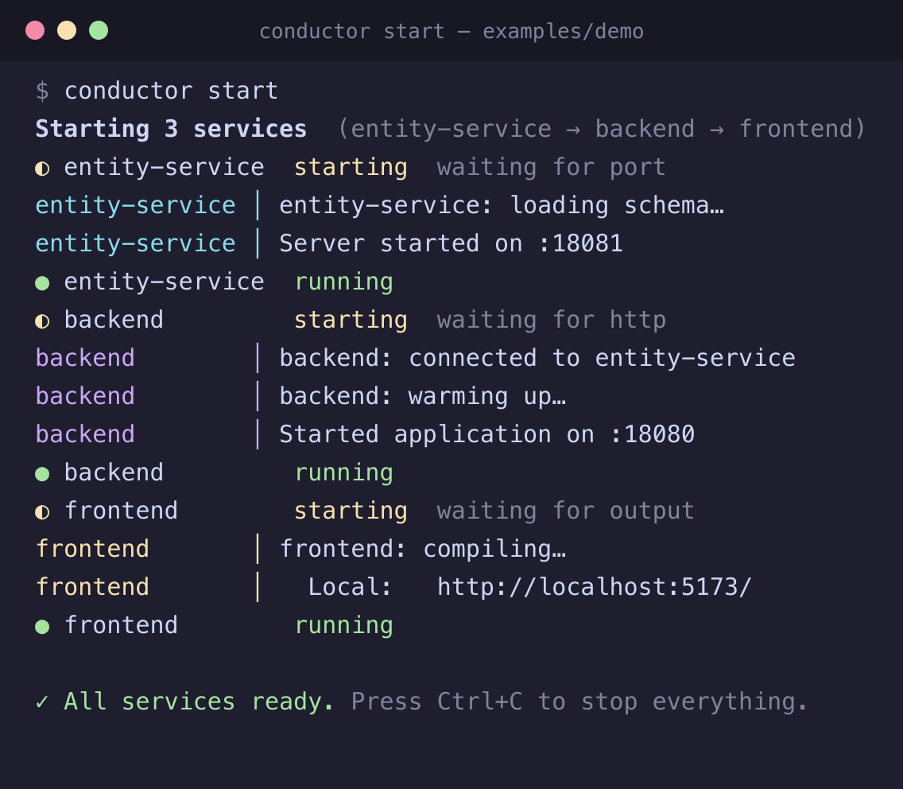

# Conductor

Start a multi-service dev environment with one command. Services start in dependency order, and each one
only starts **after the services it depends on are actually ready**, not after a guessed `sleep 5`.

```
entity-service ──► backend ──► frontend
   port 8081       /health      "Local:" in logs
```



*Real output of `conductor start` on [examples/demo](examples/demo). Each service is started only after the previous one is ready.*

## Quick start

```bash
npm install
npm run build

# try the demo (3 fake services that crash if started out of order)
cd examples/demo
node ../../packages/cli/dist/index.js start
```

In your own project:

```bash
conductor init        # writes .conductor/config.yaml
conductor doctor      # checks dirs, commands, ports
conductor start       # starts everything, streams logs, Ctrl+C stops in reverse order
```

To get the `conductor` command on your PATH: `npm link -w @conductor/cli`.

## Config: `.conductor/config.yaml`

```yaml
services:
  entity-service:
    path: ./entity-service        # relative to the folder containing .conductor/ (default ".")
    command: npm run dev
    wait_for: { type: port, value: 8081 }

  backend:
    path: ./backend
    command: ./gradlew bootRun
    depends_on: [entity-service]
    timeout: 180                  # seconds to wait for readiness (default 120)
    env: { SPRING_PROFILES_ACTIVE: dev }
    requires: [java]              # checked by `conductor doctor`
    wait_for: { type: http, url: "http://localhost:8080/health" }

  frontend:
    path: ./frontend
    command: npm run dev
    depends_on: [backend]
    wait_for: { type: output, contains: "Local:" }
```

| `wait_for.type` | Ready when |
| --- | --- |
| `port` (`value`, optional `host`) | the TCP port accepts connections |
| `http` (`url`, optional `status`) | the URL answers 2xx/3xx (or exactly `status`) |
| `output` (`contains` or `regex`) | the text appears in stdout/stderr |
| `exit` | the process exits with code 0 (migrations, seeds) |
| `none` (default) | the process is still alive after ~1s |

A service that exits before it is ready, or misses its `timeout`, fails the whole start: everything already
started is stopped again and the reason is printed. Services with no dependency between them start in parallel.

## CLI

| Command | |
| --- | --- |
| `conductor init` | create a starter config |
| `conductor start [services...]` | start all, or the named services plus their dependencies |
| `conductor stop` | stop a running `conductor start` from another terminal (also cleans up after a `kill -9`) |
| `conductor status` | what is running |
| `conductor doctor` | check directories, commands, required tools, and busy ports |
| `conductor graph` | show start order |

## VS Code extension

Sidebar with live status, one terminal per service, Start/Stop/Restart (all or per service), a status bar
item, and autocomplete and validation for the config (with the Red Hat YAML extension installed).

```bash
npm run build
npm run package -w conductor-vscode          # -> packages/vscode/conductor.vsix
code --install-extension packages/vscode/conductor.vsix
```

Restarting a single service leaves its dependents running. Stopping a service also stops the services that
depend on it (dependents first).

## Layout

```
packages/core     engine: config, graph, process manager, readiness checks, doctor (no VS Code dependency)
packages/cli      `conductor` command
packages/vscode   extension (bundles core)
examples/demo     three-service demo
```

## Development

```bash
npm test            # vitest: graph, config, ordering, readiness, failure teardown, process trees
npm run typecheck
```

## Known limits

- Services run without a PTY, so interactive prompts don't work and some tools disable colour
  (`FORCE_COLOR=1` is set to help). Fine for servers and watchers.
- Developed and tested on macOS. Process-tree stopping on Windows uses `taskkill /T /F` (no graceful
  shutdown) and `conductor stop`'s orphan cleanup is POSIX only; neither is tested.
- Multi-root workspaces use the first folder.

## Contributing

Issues and pull requests are welcome. See [CONTRIBUTING.md](CONTRIBUTING.md).

## License

[MIT](LICENSE)
